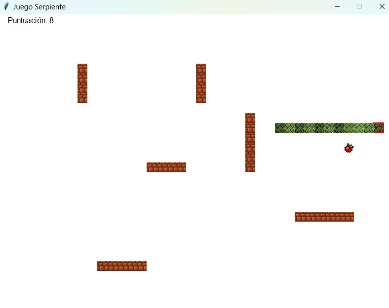
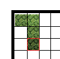
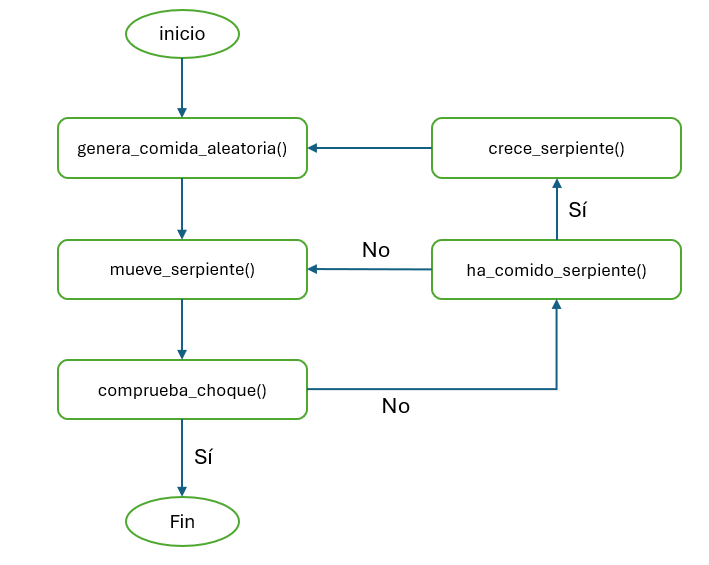

# 🐍 Proyecto de Laboratorio: Juego de la Serpiente
## Fundamentos de Programación 1. Grado en Ingeniería Informática – Inteligencia Artificial (Universidad de Sevilla)

Se ha diseñado un juego llamado "Serpiente", y ya se dispone de la implementación de su interfaz gráfica en el módulo `serpiente_gui.py`. Sin embargo, aún faltan por implementar algunas funciones encargadas de parte de la lógica de funcionamiento del juego. Se requieren tus habilidades con el manejo de listas y tuplas para completar dicha implementación.

El objetivo del juego es manejar a la serpiente por el tablero de juego, intentando atrapar la comida, y evitando chocarse con las paredes o consigo misma (ver imagen). A medida que come, la serpiente irá creciendo. Además, el tablero de juego es toroidal, de manera que la serpiente puede salir por la izquierda y aparecer por la derecha, por ejemplo.



---

## Preparación del entorno

👉 Para configurar Git y clonar el repositorio del laboratorio, consulta **[instrucciones_git.md](https://github.com/FP1-25-26/FP1-LAB01-Calculadora-de-viajes-espaciales/blob/main/instrucciones_git.md)**.  

---

## ⏱ Duración estimada

2 horas 

---

## ✅ ¿Qué se practica?

- Tipos de datos no escalares: `tuple` y `list`
- Métodos y operaciones de `list`
- Tratamientos secuenciales

---

## 📁 Archivos del proyecto

Dispones de estos archivos en `src`:

| Archivo                  | Qué hace                                                                  |
|--------------------------|---------------------------------------------------------------------------|
| `serpiente_gui.py`      | Interfaz gráfica del juego. El programa principal está aquí. |
| `serpiente_utiles.py`   | Funciones relacionadas con la lógica del juego, excluyendo la generación de paredes. |
| `serpiente_utiles_test.py` | Pruebas de las funciones del módulo `serpiente_utiles.py`|
---

## Representación de los datos del juego

Para poder implementar el juego, ha sido necesario diseñar la representación de los datos relativos a las distintas entidades que participan en el juego. 

### Representación del tablero de juego
El tablero de juego está compuesto por posiciones ``(columna, fila)``, de manera que la posición de la esquina superior izquierda sería la ``(0, 0)``. De esta manera, todos los elementos que se representan en el tablero (serpiente, comida y paredes) estarán compuestos de tuplas ``(columna, fila)`` indicando sus posiciones, como se explica a continuación.

### Representación de la serpiente

La serpiente está representada por una lista de posiciones de cada uno de los segmentos de su cuerpo. Cada posición es una tupla ``(columna, fila)``, o si entendemos el tablero como un plano, ``(x, y)``. Por ejemplo, esta serpiente, que está compuesta por 4 segmentos y cuya cabeza (donde comienza el cuerpo) está marcada por un cuadrado rojo:
 


, estaría representada por la siguiente **lista de tuplas** (suponiendo que el último segmento del cuerpo de la serpiente estuviera en la esquina superior izquierda del tablero de juego):

```python
            # Cabeza                  Cola
            # x  y    x  y    x  y    x  y
serpiente = [(1, 2), (1, 1), (1, 0), (0, 0)]
```

### Representación de la comida

La comida ocupa una única posición del tablero (aunque cambiará cuando la serpiente se la coma), y por tanto se representa mediante una **tupla** ``(columna, fila)`` que indica su posición.

### Representación de las paredes

Cada pared del tablero de juego se representa de forma similar a la serpiente, mediante una lista de tuplas que indican las posiciones de cada segmento de pared. Como en el tablero habrá varias paredes, las representaremos como una **lista de listas de tuplas**.

Las paredes del juego están fijadas de antemano, puedes ver su definición en la variable `PAREDES` al comienzo del módulo `serpiente_gui.py`.

---
### Bucle principal del juego
El ciclo principal de ejecución del juego es tal como se presenta en el siguiente diagrama:
 


En los siguientes ejercicios, vamos a implementar las funciones que aparecen en este diagrama, para que el juego sea funcional. 

## 📌 Ejercicio 1: Función `ha_comido_serpiente`
Implementa la función `ha_comido_serpiente` que recibe una lista de tuplas que representa a la serpiente, y una tupla indicando la posición actual de la comida, y devuelve `True` si la serpiente ha alcanzado la comida con su cabeza (y `False` en caso contrario).

Prueba la función ejecutando las pruebas del módulo `serpiente_utiles_test.py`. 

## 📌 Ejercicio 2: Función `comprueba_choque`
Implementa la función `comprueba_choque` que recibe una lista de tuplas que representa a la serpiente, y una lista de listas de tuplas que representa las paredes, y devuelve `True` si la serpiente ha chocado consigo misma o con alguna de las paredes (y `False` en caso contrario). 

Fíjate en que, al moverse la serpiente, es su cabeza la que ocupa una nueva posición. Bastará con comprobar si la cabeza de la serpiente está en la misma posición que alguno de los segmentos del resto de su cuerpo, o en alguna de las paredes. 

Prueba la función ejecutando las pruebas del módulo `serpiente_utiles_test.py`. 

## 📌 Ejercicio 3: Función `crece_serpiente`
Implementa la función `crece_serpiente` que recibe una lista de tuplas que representa a la serpiente, y modifica dicha lista haciendo que la serpiente crezca en una posición. Para hacer crecer a la serpiente, **basta con duplicar el último segmento de su cuerpo**. 

**Explicación**: Aunque puede resultar extraño que la serpiente al crecer contenga dos segmentos finales en la misma posición del tablero, cuando en el bucle del juego se ejecute la función `mueve_serpiente` (cosa que ocurre antes de volver a pintar la serpiente en la interfaz gráfica) esto será corregido: todo el cuerpo se moverá (menos la última posición), y la serpiente habrá crecido por la cola.

Prueba la función ejecutando las pruebas del módulo `serpiente_utiles_test.py`. 

## 📌 Ejercicio 4: Función `genera_comida_aleatoria`
Implementa la función `genera_comida_aleatoria` que recibe una lista de tuplas que representa a la serpiente, una lista de lista de tuplas que representa las paredes del tablero, y el número de filas y de columnas que tiene el tablero de juego. La función debe devolver una posición aleatoria para la comida `(columna, fila)`. Esta posición debe cumplir las siguientes restricciones:
- Debe ser una posición válida del tablero, teniendo en cuenta el número de filas y columnas indicado por los parámetros.
- No puede estar encima del cuerpo de la serpiente.
- No puede estar encima de ninguna de las paredes.

Recuerda que podemos generar números aleatorios entre dos números enteros `n` y `m` (ambos inclusive) con la función `random.randint(n, m)`.

Prueba la función ejecutando las pruebas del módulo `serpiente_utiles_test.py`. 

## 📌 Ejercicio 5: Función `mueve_serpiente`
Implementa la función `mueve_serpiente` que recibe una lista de tuplas que representa a la serpiente, una cadena de texto que indica la dirección del movimiento, y el número de filas y de columnas del tablero de juego. La función modificará la lista de tuplas que representa a la serpiente para "moverla" en la dirección indicada.

Para hacerlo, ten en cuenta lo siguiente:
- Las direcciones permitidas son `Left`, `Right`, `Down` y `Up`. Si se recibe una dirección distinta, la función no hace nada.
- Mover la serpiente implica añadir una nueva cabeza, eligiendo la posición en función de la dirección indicada, y eliminar la última posición del cuerpo.
- El tablero del juego es **toroidal**: si la serpiente se sale por un borde del tablero, debe aparecer por el borde opuesto.


Prueba la función ejecutando las pruebas del módulo `serpiente_utiles_test.py`. 

---

Si has implementado correctamente todas las funciones, deberías poder jugar, ejecutando el módulo `serpiente_gui.py`. ¿Qué puntuación eres capaz de alcanzar?

---

## 🏆 Ejercicio avanzado: versión con dos jugadores

En esta versión del juego, competiremos contra una serpiente manejada por el ordenador. Completa todos los comentarios `# TODO` que encontraras en el módulo `avanzado/serpiente_utiles_2players.py`:

* Copia el código de las funciones que ya has implementado, incorporando las modificaciones que se te indican. **¡No modifiques los prototipos, puede haber nuevos parámetros!**
* Implementa la nueva función `decide_movimiento_ia`, encargada de decidir el siguiente movimiento de la serpiente rival. El algoritmo que seguiremos es el siguiente:
    * Para cada posible dirección, creamos una copia de la serpiente y la movemos en la dirección elegida (usa la función `mueve_serpiente`).
    * Si la serpiente copia no se ha chocado, calculamos la distancia de su cabeza a la comida.
    * De entre todas las direcciones para las que no hubo choque, escogeremos la que tenga una distancia menor a la comida.

Una vez completadas las funciones, prueba el juego ejecutando el módulo `avanzado/serpiente_gui_2players.py`. Ten en cuenta que la serpiente rival no sabe que el tablero es toroidal... ¡Aprovéchate de esta ventaja para intentar ganarle!

